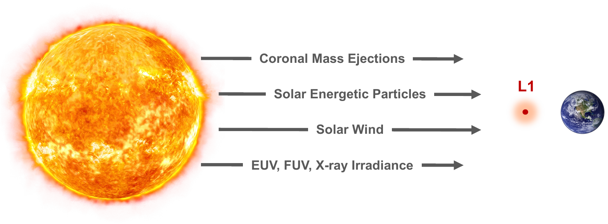

# L1 — Solar-Wind-Driven LEO Debris Decay Forecasting

Predicting short-term (1–8+ hour) atmospheric-drag-driven orbital decay of
LEO objects from real-time solar wind measurements taken
at the Sun–Earth L1 Lagrange point (NOAA's DSCOVR spacecraft).

## Motivation

Geomagnetic storms heat and inflate the upper atmosphere, which increases
drag on low-Earth-orbit objects and accelerates orbital decay — sometimes
sharply, over just a few hours. DSCOVR sits ~1.5 million km sunward of Earth
at L1 and measures the solar wind ~30–90 minutes before it reaches
Earth's magnetosphere, giving a short but real lead time. This project asks:
how much of that near-term decay response can be forecast from DSCOVR's
solar wind/IMF measurements alone, on top of an object's own recent decay
momentum?



L1 sits between the Sun and Earth and sees coronal mass ejections, solar
energetic particles, solar wind, and EUV/FUV/X-ray irradiance before they
reach Earth's magnetosphere — the lead time this project tries to exploit.

The approach:
1. Build a population-level, recency-weighted proxy for "how fast is LEO
   debris decaying right now," from TLE altitude histories across hundreds
   of debris/rocket-body objects (no single-object propagation).
2. Identify geomagnetic "stormtime" segments in that decay proxy.
3. Train a two-stage model — a momentum baseline (Ridge, on the decay
   proxy's own recent trend) plus a solar-wind-conditioned residual model
   (LightGBM), trained on stormtime segments — to forecast the decay proxy
   1–8 hours ahead, and compare its skill against a naive persistence
   baseline.

## Repository layout

```
data_prep/     Build a continuous, derived-quantity DSCOVR solar-wind CSV from raw NetCDF files
common/        Shared TLE parsing, decay-rate computation, and recency-weighted averaging
population_proxy/  Stormtime segment detection + the storm-conditioned LightGBM forecaster
analysis/      Correlation studies, RMSE comparisons, and diagnostic plots
models/        Trained model artifacts and evaluation metrics (checked in)
data/          Small reference datasets (OMNI2, Kyoto Dst, sample GP ephemerides, solar wind pickles)
plots/         Generated figures
```

Large/raw inputs (not scripts) also live at the repo root and in a few
top-level folders — see **Data** below.

### `data_prep/`
- `process_dscovr_year.py` — for each day with both a Faraday Cup
  (`oe_f1m_*`) and Magnetometer (`oe_m1m_*`) DSCOVR Level-2 file in a given
  directory, merges the two, concatenates across the full requested year
  range, and computes derived solar-wind/coupling quantities (dynamic
  pressure, clock angle, Kan–Lee and Newell coupling, Akasofu epsilon,
  Burton/O'Brien-style ring-current proxies, etc.) once over the continuous
  series so rolling windows don't reset at day/year boundaries. Produces the
  `dscovr_<year(s)>_core_and_derived.csv` files consumed downstream.

### `common/`
- `find_debris_tles.py` — filters raw multi-year TLE catalog dumps
  (`tle2022.txt` … `tle2025.txt`) by estimated altitude/eccentricity and
  groups them per NORAD ID (no SGP4 propagation — altitude is approximated
  from mean motion via Kepler's third law). Output feeds `deb_tles_all/`.
- `calculate_average_decay_original.py` — for each object, computes a
  drag-normalized decay rate per TLE interval, standardizes it to that
  object's own mean/std, then pools every object's measurements into a
  single population-level series via a causal, recency-weighted average
  (weight decays with time since each measurement, never looking ahead).

### `population_proxy/`
- `find_stormtime_segments.py` — flags maximal runs where the pooled decay
  proxy drops below a threshold (default z < −2), pads each run to capture
  storm run-up/recovery, and merges overlapping runs into
  `stormtime_segments.csv`.
- `gbm_stormtime_solar_wind_to_decay.py` — the main forecaster. Two-stage
  design: a multi-output Ridge model on decay momentum (Stage 1) plus a
  shared, horizon-conditioned LightGBM model on solar-wind (and optionally
  decay) features (Stage 2), trained only on stormtime-segment origins, with
  whole storm segments (never split mid-storm) assigned to train/val/test.
  Reports RMSE/R²/delta-correlation by forecast horizon against both
  persistence and Stage-1-only baselines, plus quantile-based uncertainty
  bands. See the file's module docstring for the full modeling rationale.

  ```
  python population_proxy/gbm_stormtime_solar_wind_to_decay.py train
  python population_proxy/gbm_stormtime_solar_wind_to_decay.py train --out-hours 10 --zoom-fan-stride-hours 3
  ```

### `analysis/`
Correlation and diagnostic scripts: lagged solar-wind/decay correlations
(`solar_wind_correlations.py`, `solar_wind_interaction_correlations.py`),
a correlation matrix (`correlation_matrix.py`), transformation-pipeline
visualizations (`plot_transformation_steps*.py`, `plot_decay_components.py`),
a Swarm-satellite cross-check (`plot_swarm_comparison.py`), converting
z-score prediction error into physical along-track position error
(`physical_units_comparison.py`), and normal-vs-extreme-event RMSE
comparisons (`compare_extreme_event_rmse.py`).


### `models/`
Checked-in artifacts from the current trained forecaster
(`gbm_stormtime_solar_wind_to_decay/`): the LightGBM boosters
(point + lo/hi quantile), `metrics_summary.json` (headline skill numbers),
and `metrics_by_horizon.csv` (RMSE/R²/delta-correlation per forecast hour,
1–8h).

## Data

Not all of this is tracked in git (see `.gitignore`/repo size before adding
anything large):

- `tle20{22,23,24,25}.txt` — raw multi-year TLE catalog dumps (multi-GB each).
- `satcat.csv` — Space-Track satellite catalog export (NORAD ID → name/type).
- `deb_tles_all/` — per-NORAD-ID TLE files for the filtered debris/rocket-body
  population, produced by `common/find_debris_tles.py`.
- `dscovr/` — raw daily DSCOVR Level-2 NetCDF files (Faraday Cup `oe_f1m_*`
  and Magnetometer `oe_m1m_*`), gzip or plain.
- `dscovr_2022_2026/`, `dscovr_2024/` — merged, derived-quantity CSVs
  produced by `data_prep/process_dscovr_year.py`.
- `data/` — smaller reference inputs: OMNI2 hourly data, Kyoto Dst index,
  sample GP ephemerides for a few objects, and cached solar-wind pickles.
- `deb_tles_all/` currently holds 187 objects; `dscovr/` currently holds
  ~2,800 daily raw files (spanning 2022–2025).

## Typical pipeline

1. `common/find_debris_tles.py` — filter raw TLE catalogs into
   `deb_tles_all/`.
2. `data_prep/process_dscovr_year.py` — build the merged DSCOVR
   core-and-derived CSV for the years of interest.
3. `common/calculate_average_decay_original.py` — compute the pooled,
   recency-weighted decay-rate proxy from `deb_tles_all/`.
4. `population_proxy/find_stormtime_segments.py` — detect stormtime segments
   in that proxy.
5. `population_proxy/gbm_stormtime_solar_wind_to_decay.py train` — train and
   evaluate the two-stage forecaster.
6. `analysis/*.py` — correlation studies and diagnostic plots on top of the
   above.

## Requirements

scripts import `numpy`, `pandas`, `matplotlib`, `scipy`, `xarray`, `scikit-learn`, and `lightgbm`.
the project has been run under both Python 3.9 and 3.10.
